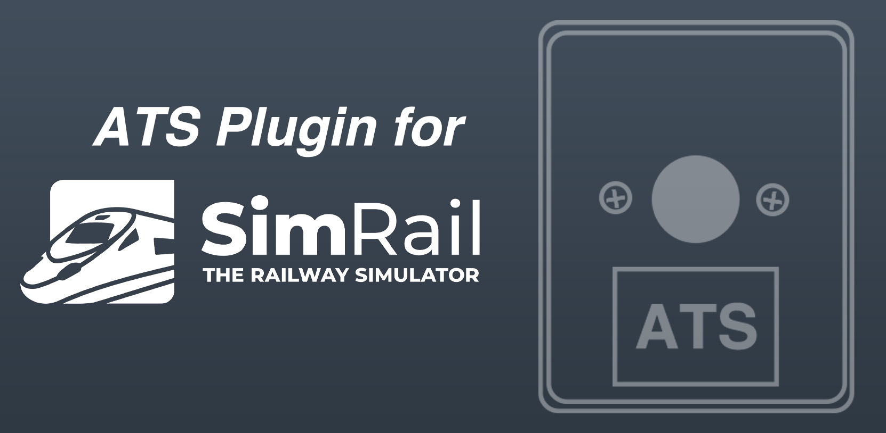
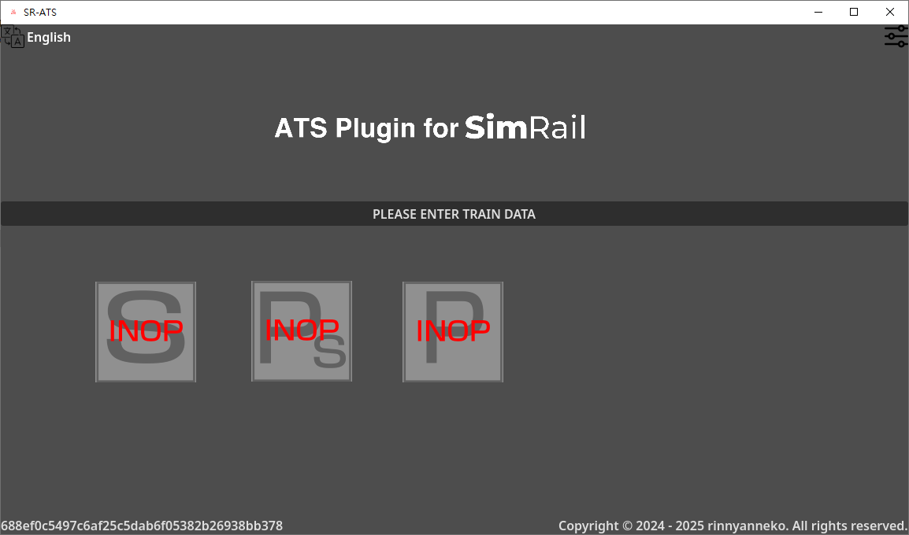
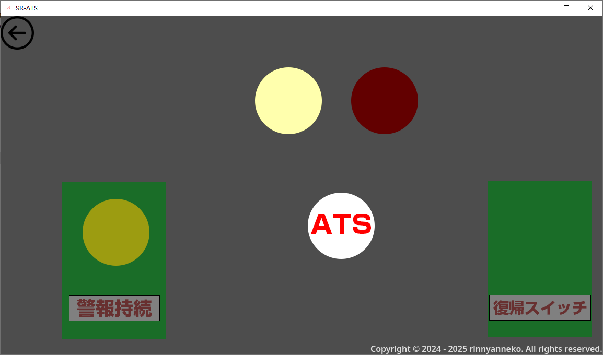
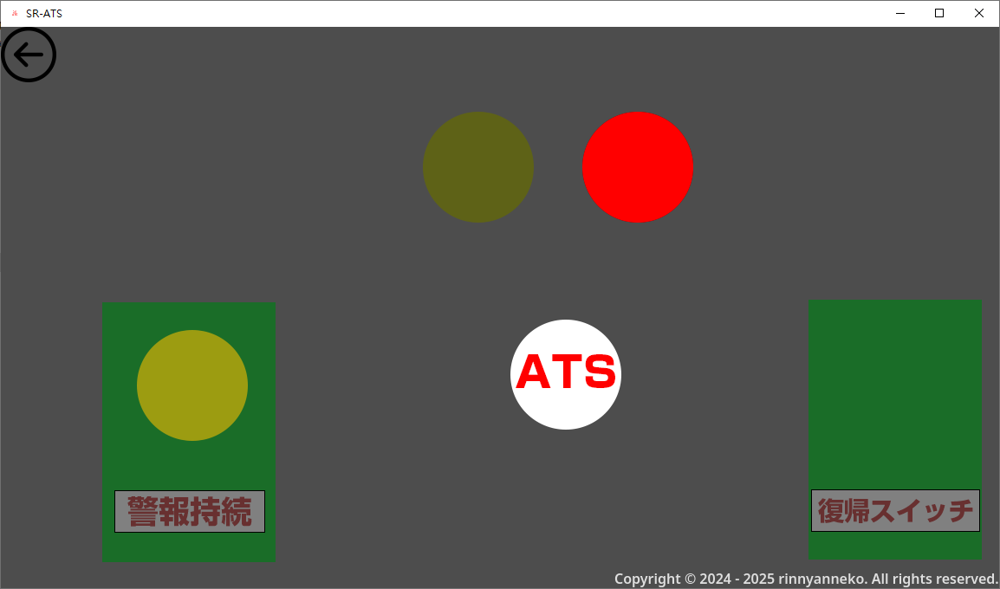
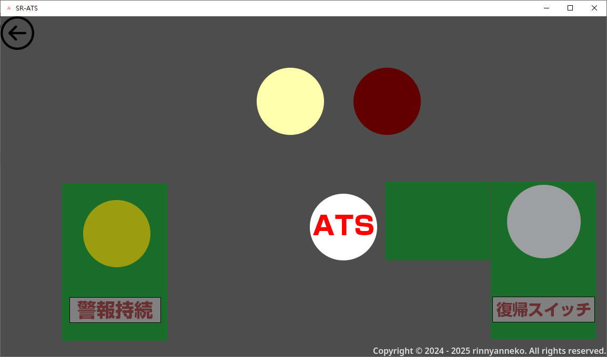
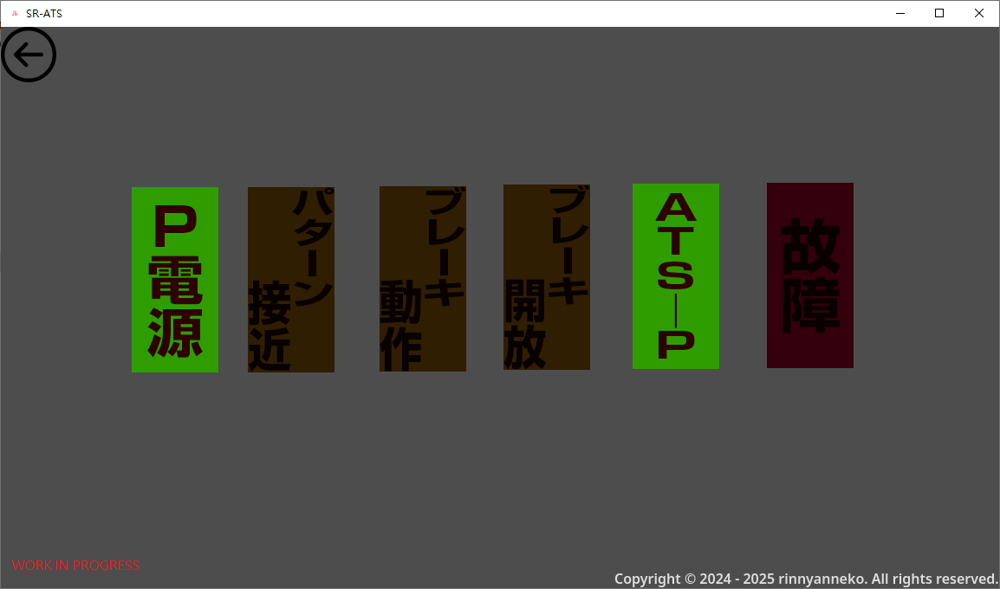

# SR-ATS



Automatic Train Protection systems for [SimRail](https://simrail.eu/en/our-games/simrail-2021)

Written with [Godot Game Engine 4.6 .NET](https://godotengine.org)

[Help with translation](https://crowdin.com/project/sr-ats)

Runtime scripts are C\# .NET. Build and run locally with:

```sh
dotnet build SR-ATS.sln
godot --path .
```

Feel free to open a pull request!

[Milestone](milestone.md)

[GitHub page](https://github.com/rinnyanneko/SR-ATS)

[GitCode Page(for China users download)](https://gitcode.com/rinnyanneko/SR-ATS/)

Please give me a star!

# Screenshots












# Support this project!

[Donate me!](https://mirukuneko.cc/donate)
